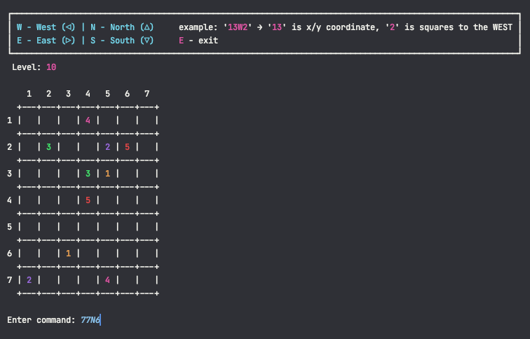
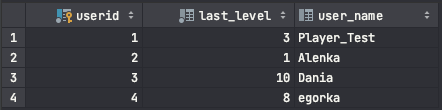
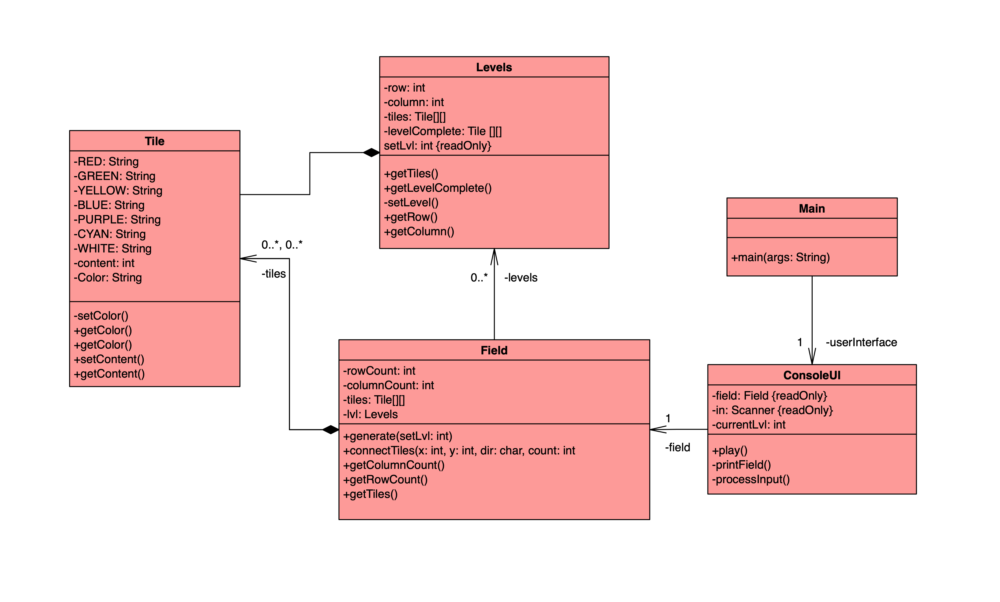
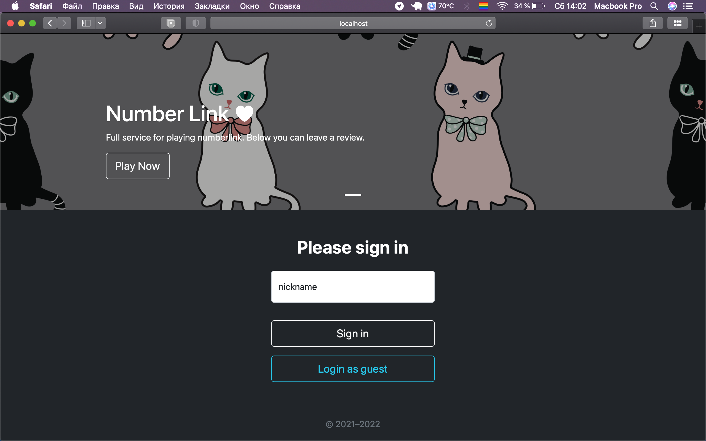
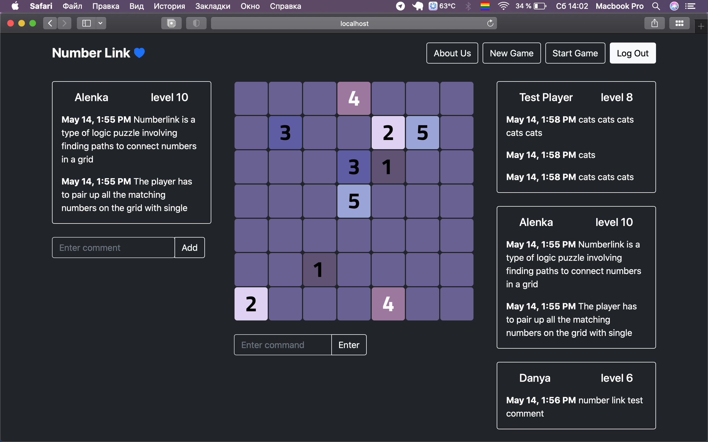

#### **Number link is a type of logic puzzle involving finding paths to connect numbers in a grid. Rules − The player has to pair up all the matching numbers on the grid with single continuous lines (or paths).**

### **Video Presentation**

> **https://youtu.be/K9xVJPGDz0M** Final version

> **https://www.youtube.com/watch?v=4O8ZoFhhQwk** JPA + REST

### **NumberLink**

### **Database example**

### **UML Diagram (will be updated at the end)**

### **Web**

#### **good job <3**

